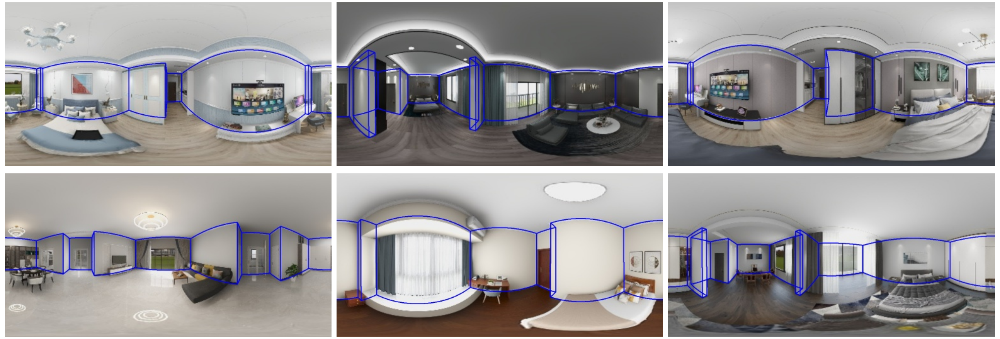
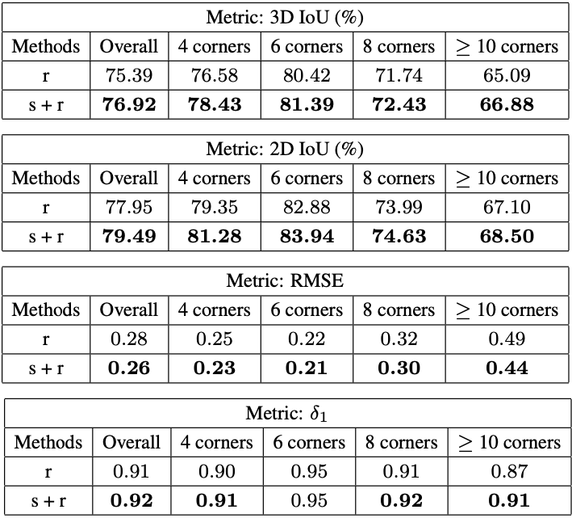

# Layout Estimation

## Introduction

Layout estimiation is a challenging task in 3D vision. Several datasets are proposed to tackle this problem, including the large scale synthetic dataset Structured3D. 
MINERVAS system has the ability to generate dataset like Structured3D.

Here we show the DSL for generating data which helps boosting the current layout estimation task.
<!-- We will show the ability of Minvervas by agumentating the layout estimation task, which obtains state-of-the-art results. -->
More details can be found in the [paper](https://arxiv.org/pdf/2107.06149.pdf) and [supplementary document](https://drive.google.com/file/d/1avGTr44sGrWx_jWiNYEIrp3R7jbNPOgj/view).


## DSL code
<!-- For room layout estimation task, we create a
filter rule using DSL in the Scene Process Stage, and setting
the type of camera as “panorama”. We also use the sampler
of the transform component to randomly move cameras, and
use the output component to write out corner positions and
camera parameters. -->

<!-- 
First, we import some necessary packages.
```python
from ksecs.ECS.processors.scene_processor import SceneProcessor
from ksecs.ECS.processors.entity_processor import EntityProcessor
from ksecs.ECS.processors.pixel_processor import PixelProcessor
from ksecs.ECS.processors.structure_processor import StructureProcessor
import copy
import glm
``` -->

<!-- First, we filter scenes which get rooms with manhattan layout assumption in the Scene Process Stage, as implemented in the `ManhattanSceneFilter`.

In the entity process stage, we first filter cameras in the relative empty rooms as shown in `CameraFilter`.

Then, we setup the camera parameters in `CameraSetting`. We also adopt domain randomization for cameras as shown in `CameraRandomizer`.

After the rendering process stage, we setup customized output for generating information about room structure as shown in `StructureOutput`. -->
In this example, we generate both panoramic rgb images and scene structure information.

 We first filter scenes with Manhattan-world assumption using `ManhattanSceneFilter` in the Scene Process Stage. 
 
 In the Entity Process Stage, we then remove the cameras in the relatively empty rooms using `CameraFilter`. Next, we set the camera parameters (\eg, camera type and image resolution) using `CameraSetting`. 
 We randomize the positions of the cameras using `CameraRandomizer`.
 
 After the Rendering Process Stage, we record the positions of room corners and cameras using `StructureOutput`.

<!-- For this task, we set the type of camera to `PANORAMA` in Entity Process Stage, and output the corner and camera parameters in the Entity Process Stage. -->

```python
from ksecs.ECS.processors.scene_processor import SceneProcessor
import glm
import copy
import sys
class ManhattanSceneFilter(SceneProcessor):
    def is_manhattan_scene(self):
        # Check Manhattan assumption for each room
        Valid = False
        for room in self.shader.world.rooms:
            corners = room.boundary
            shift_corners = copy.deepcopy(corners)
            shift_corners.append(shift_corners.pop(0))
            for i in range(len(shift_corners)):
                direction = glm.vec2(shift_corners[i]).xy - glm.vec2(corners[i]).xy
                direction = glm.normalize(direction)
                shift_corners[i] = direction
            EPSILON = 0.001
            MANHATTAN = True
            for i in range(len(shift_corners)):
                cos = glm.dot(shift_corners[i], shift_corners[(i + 1) % len(shift_corners)])
                if cos > EPSILON:
                    MANHATTAN = False
                    break
            if MANHATTAN:
                Valid = True
        return Valid

    def process(self):
        if not self.is_manhattan_scene():
            sys.exit(7)

from ksecs.ECS.processors.entity_processor import EntityProcessor
from shapely.geometry import Point
class CameraFilter(EntityProcessor):
    def is_valid_room(self, room, num_furniture=3):
        # Check if the number of furniture in the room is above threshold.
        polygon = room.gen_polygon()
        count = 0
        for ins in self.shader.world.instances:
            if not ins.type == 'ASSET':
                continue
            if polygon.contains(Point([ins.transform[i] for i in [3, 7, 11]])):
                count += 1
        return count > num_furniture
    
    def delete_cameras_in_room(self, room):
        polygon = room.gen_polygon()
        for camera in self.shader.world.cameras:
            if polygon.contains(Point([camera.position[axis] for axis in "xyz"])):
                self.shader.world.delete_entity(camera)

    def process(self):
        # We only use rooms with more than 4 assets
        for room in self.shader.world.rooms:
            if not self.is_valid_room(room, 4):
                self.delete_cameras_in_room(room)

class CameraSetting(EntityProcessor):
    def process(self):
        for camera in self.shader.world.cameras:
            camera.set_attr("imageWidth", 1024)
            camera.set_attr("imageHeight", 512)
            camera.set_attr("cameraType", "PANORAMA")

import numpy as np
class CameraRandomizer(EntityProcessor):
    def process(self):
        for camera in self.shader.world.cameras:
            random_vec = np.random.normal(0, 1, size=3)
            camera_pos = np.array(list(camera.position.values()))
            randomized_pos = camera_pos + random_vec * np.array([500.0, 500.0, 50.0])
            camera.set_attr('position', x=randomized_pos[0], y=randomized_pos[1], z=randomized_pos[2])
            camera.set_attr('lookAt', z=randomized_pos[2])

from ksecs.ECS.processors.render_processor import RenderProcessor
class Render(RenderProcessor):
    def process(self, *args, **kwargs):
        self.gen_rgb(distort=0, noise=0)

from ksecs.ECS.processors.structure_processor import StructureProcessor
class StructureOutput(StructureProcessor):
    def process(self):
        # write out the corners of the rooms in the scene
        for room in self.shader.world.rooms:
            for plane, height in zip(["floor", "ceiling"], [0, self.shader.world.levels[0].height]):
                corners = []
                for corner in room.boundary:
                    corners.append({'x': corner[0], 'y': corner[1], 'z': height})
                self.shader.world.pick(
                    corners=corners,
                    catName=plane,
                    type='corners',
                    id=f"{room.roomId}_{plane}"
                )
        # write out cameras in the scene
        for camera in self.shader.world.cameras:
            self.shader.world.pick(
                type="camera",
                position=camera.position,
                id=camera.id
            )
```

## MINERVAS output samples
<!-- TBD. -->

<!-- ## Experimental Setup

In this experiment, we use MatterportLayout [[1, 2]](#1) as the real data. The dataset consists of 1,647 images for training, 190 images for validation, and 458 images for testing. Then, we synthesize 120K panorama images from 80K scenes using our system. Each panorama image corresponds to one room in scenes.
Following [[2]](#2), we adopt four standard metrics: 3D IoU,
2D IoU, RMSE and the accuracy under the threshold (δ1).
We adopt HorizonNet [[3]](#3) as the baseline approach. We use
an Adam optimizer with an initial learning rate of 3 × 10−4
with a polynomial decay policy. We set the mini-batch size
to 24. We also use two training strategies in this experi-
ment, i.e., “r” and “s + r”. In “s + r”, each batch contains
16 images from the real dataset and 8 from the synthetic
dataset. For each strategy, we train the whole network for
30K iterations

## Experiment Results

Results are reported in Table 1. As can be seen, the model trained on both the synthetic and real datasets achieves the best result. After augmenting the synthetic data, the network can predict the corner's position more accurately. Meanwhile, the predicted number of corners is more accurate. It demonstrates that our synthetic data could be used to improve the performance of the network. Qualitative results are shown in Figure 2.


 -->
<!-- 
## References
<a id="1">[1]</a> 
Angel X. Chang, Angela Dai, Thomas A. Funkhouser, Maciej Halber, Matthias Nießner, Manolis Savva, Shuran Song, Andy Zeng, and Yinda Zhang. Matterport3d: Learning from RGB-D data in indoor environments. In 3DV, pages 667–676, 2017.

<a id="2">[2]</a> 
Chuhang Zou, Jheng-Wei Su, Chi-Han Peng, Alex Colburn, Qi Shan, Peter Wonka, Hung-Kuo Chu, and Derek Hoiem. Manhattan room layout reconstruction from a single 360 image: A comparative study of state-of-the-art methods. International Journal of Computer Vision, 2021.

<a id="3">[3]</a> 
Cheng Sun, Chi-Wei Hsiao, Min Sun, and Hwann-Tzong Chen. Horizonnet: Learning room layout with 1d representation and pano stretch data augmentation. In CVPR, pages 1047–1056, 2019. -->