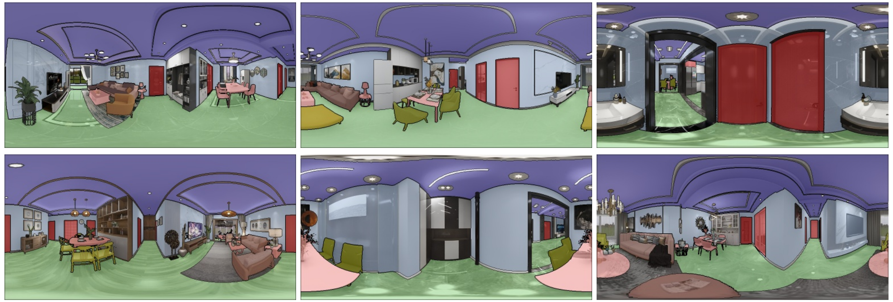
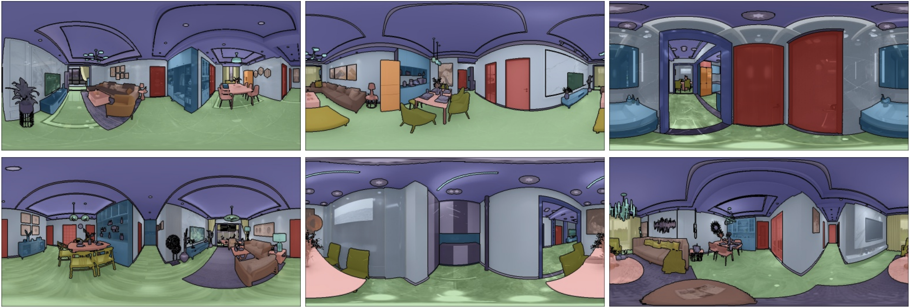

# Semantic Segmentation

## Introduction
Depth estimiation is an essential task in indoor scene understanding. We show the performance gain by generating dataset using our system.

Here we show the DSL for generating semantic mask in NYUd-v2-40 format which helps boosting the current semantic segmentation task.

More details can be found in the [paper](https://arxiv.org/pdf/2107.06149.pdf) and [supplementary document](https://drive.google.com/file/d/1avGTr44sGrWx_jWiNYEIrp3R7jbNPOgj/view).
## DSL code
<!-- For room layout estimation task, we create a
filter rule using DSL in the Scene Process Stage, and setting
the type of camera as “panorama”. We also use the sampler
of the transform component to randomly move cameras, and
use the output component to write out corner positions and
camera parameters. -->
In this example, we generate semantic labels and show the domain randomization ability of the MINERVAS system.

First, in the Entity Process Stage we filter out cameras in the rooms which do not has more than 4 furniture using `CameraFilter`. 
For each camera, we set the camera model as `panoramar` and the resolution of the image to 640 * 480 in class `CameraSetting`. 

We then utilize the system's ability for domain randomization to generate data. Specifically, we randomize room layout in the Scene Process Stage using `FurnitureLayoutSampler`. Then, we randomize material, model and camera in the Entity Process Stage using `EntityRandomizer`. 

In the Pixel Process Stage, we generate semantic label with NYUv2 40 label set as shown in `SemanticOutput` class.

```python
from ksecs.ECS.processors.entity_processor import EntityProcessor
from shapely.geometry import Point
class CameraFilter(EntityProcessor):
    def is_valid_room(self, room, num_furniture=3):
        # Check if the number of furniture in the room is above threshold.
        polygon = room.gen_polygon()
        count = 0
        for ins in self.shader.world.instances:
            if not ins.type == 'ASSET':
                continue
            if polygon.contains(Point([ins.transform[i] for i in [3, 7, 11]])):
                count += 1
        return count > num_furniture
    
    def delete_cameras_in_room(self, room):
        polygon = room.gen_polygon()
        for camera in self.shader.world.cameras:
            if polygon.contains(Point([camera.position[axis] for axis in "xyz"])):
                self.shader.world.delete_entity(camera)

    def process(self):
        # We only use rooms with more than 4 assets
        for room in self.shader.world.rooms:
            if not self.is_valid_room(room, 4):
                self.delete_cameras_in_room(room)

class CameraSetting(EntityProcessor):
    def process(self):
        for camera in self.shader.world.cameras:
            camera.set_attr("imageWidth", 1024)
            camera.set_attr("imageHeight", 512)
            camera.set_attr("cameraType", "PANORAMA")

# Randomize layout
from ksecs.ECS.processors.scene_processor import SceneProcessor
class FurnitureLayoutSampler(SceneProcessor):
    def process(self):
        for room in self.shader.world.rooms:
            room.randomize_layout(self.shader.world)

import numpy as np
class EntityRandomizer(EntityProcessor):
    def randomize_model_material(self):
        for instance in self.shader.world.instances:
            # Randomize material
            self.shader.world.replace_material(
                id=instance.id,
                type='REPLACE_ALL'
            )
            if instance.type == 'ASSET':
                # Randomize model
                self.shader.world.replace_model(
                    id=instance.id
                )

    def randomize_light(self):
        for light in self.shader.world.lights:
            # Randonly adjust the color temperature
            light._tune_temp(1)
            # Randomly adjust the light intensity
            light.tune_random(1.2)

    def randomize_camera(self):
        for camera in self.shader.world.cameras:
            random_vec = np.random.normal(0, 1, size=3)
            camera_pos = np.array(list(camera.position.values()))
            randomized_pos = camera_pos + random_vec * np.array([500.0, 500.0, 100.0])
            camera.set_attr('position', x=randomized_pos[0], y=randomized_pos[1], z=randomized_pos[2])
            camera.set_attr('lookAt', z=randomized_pos[2])

    def process(self):
        self.randomize_model_material()
        self.randomize_light()
        self.randomize_camera()

from ksecs.ECS.processors.render_processor import RenderProcessor
class Render(RenderProcessor):
    def process(self, *args, **kwargs):
        self.gen_rgb(distort=0, noise=0)

from ksecs.ECS.processors.pixel_processor import PixelProcessor
from ksecs.resources import NYU40_MAPPING
class SemanticOutput(PixelProcessor):
    def process(self, **kwargs):
        self.gen_semantic(label_arch=NYU40_MAPPING)
```

<!-- First, we import some necessary packages.
```python
from ksecs.ECS.processors.pixel_processor import PixelProcessor
from ksecs.ECS.processors.entity_processor import EntityProcessor
```

For the semantic segmentation task, we set the type of camera to panorama in the Entity Process Stage, and output the semantic label image in the Pixel Process Stage.
We also map our semantic label to the NYUv2 40 label set using our DSL.

```python
class CameraSetting(EntityProcessor):
    def process(self):
        for camera in self.shader.world.cameras:
            camera.set_attr("imageWidth", 1024)
            camera.set_attr("imageHeight", 512)
            camera.set_attr("cameraType", "PANORAMA")
```

```python
class LabelMapping(PixelProcessor):
    def process(self, **kwargs):
        self.gen_semantic(label_arch=NYU40_Mapping)
``` -->

## MINERVAS output samples
<!-- TBD. -->
<!--  -->


<!-- ## Experimental Setup

In this experiment, we use 2D-3D-S [[1]](#1) as the real data. We split the images into 955 for
training, 84 for validation, and 373 for testing. Then, we
synthesize 12k panoramic images using our system. Each
panorama image corresponds to one room in scenes.
We use an SGD optimizer with an initial learning rate of
2 × 10−2 with a polynomial decay policy, momentum 0.9,
and weight decay of 10−4. We set the mini-batch size to
8. In “s + r”, each batch contains 4 images from the real
dataset and 4 from the synthetic dataset. For each strategy,
we train the whole network for 10k iterations.

## Results

We show more qualitative results of semantic segmentation in Figure 5. As can be seen, training
on the synthetic and real dataset achieves the best result.
The boundary is more clear in semantic segmentation. It
demonstrates that our synthetic data could be used to im-
prove the performance of network.


<!--  -->

<!-- ## References
<a id="1">[1]</a> 
Iro Armeni, Sasha Sax, Amir R Zamir, and Silvio Savarese. Joint 2d-3d-semantic data for indoor scene understanding. arXiv preprint arXiv:1702.01105, 2017. -->