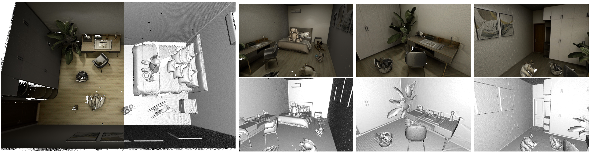

# SLAM
## Introduction
Simultaneous localization and mapping (SLAM) is the computational problem of constructing or updating a map of an unknown environment while simultaneously keeping track of an agent's location within it[<sup>1</sup>](#2).
Real-time, high-quality, 3D scanning of large-scale scenes is key to mixed reality and robotic applications like SLAM. 
In dense SLAM, a space is mapped by fusing the data from a
moving sensor into a representation of the continuous surfaces. 

In this experiment, we utilize our system for the
SLAM learning task by generating images from a sequence
of camera views, generated by our trajectory sampler.

## DSL code

First, we import some necessary packages.
```python
from ksecs.ECS.processors.entity_processor import EntityProcessor
import glm
```

Our system give users the ability to create their custom camera trajectory.
<!-- The ECS-D architecture and basic sampler give users the ability to create their scene sample strategy.  -->
We show an example of custom trajectory sampler DSL below. 

```python
class CustomTrajectorySampler(EntityProcessor):

    def calculate_vel(self, velocity, step_time):
        mu = glm.normalize(glm.vec2(np.random.normal(0, 1, size=2)))
        FORCE = 100
        f = FORCE * mu
        PHI, A, C_D, M = 1.204, 0.09, 0.1, 1.0
        d = -0.5 * glm.normalize(velocity) * PHI * A * C_D * glm.dot(velocity, velocity)
        velocity = velocity + (d + f) * M * step_time
        S_MAX = 10
        if S_MAX < sqrt(glm.dot(velocity, velocity)):
            velocity = S_MAX * glm.normalize(velocity)
        return velocity

    def process(self):
        for camera in self.shader.world.cameras:
            self.shader.world.delete_entity(camera)

        key_points = []
        for room in self.shader.world.rooms:
            # init
            room_points = []
            room_polygon = room.gen_polygon()
            camera_vel = glm.normalize(glm.vec2(np.random.normal(0, 1, size=2)))
            camera_pos = glm.vec2(room.position)
            # calcaulate road points
            length_of_trajectory, delta_time, scale = 100, 0.03, 1000
            for i in range(length_of_trajectory):
                # Camera
                camera_vel = self.calculate_vel(camera_vel, delta_time)
                new_position = camera_pos + scale * camera_vel * delta_time
                next_camera_point = Point(tuple(new_position.xy))
                if not next_camera_point.within(room_polygon):
                    p1, p2 = nearest_points(room_polygon, next_camera_point)
                    normal = glm.normalize(glm.vec2(p1.x - p2.x, p1.y - p2.y))
                    camera_vel = glm.reflect(camera_vel, normal)
                camera_pos = camera_pos + scale * camera_vel * delta_time
                room_points.append(list(camera_pos))

            key_points.append(room_points)

        self.make_traj(
            imageHeight=480,
            imageWidth=640,
            keyPoints=key_points,
            speed=1200,
            fps=3,
            speedMode=1,
            pitchMode=1,
            pitch=[-10, 10],
            hfov=70,
            vfov=55,
            height=1400,
            heightMode=1,
            cameraType="PERSPECTIVE"
        )
```

## MINERVAS output sample
After running with the DSL above, we can get a sequence of images (color and depth) along camera trajectory as shown below.


## Experimental Setup
We evaluated the usability of our system in this field based on the open source SLAM algorithm Bundlefusion [[2]](#2)

## Result
A qualitative result is shown below. Scenes can 
be robustly reconstructed, as well as the textures of objects. 
This demonstrates that our pipeline can output the proposed 
dataset for the SLAM algorithm, and that the generated trajectory provides a good view of the interior. The results of our experiments indicate that our synthetic scenes with configurable attributes and background can be utilized to diagnose the SLAM algorithm.



## References
<a id="1">[1]</a> 
wikipedia. Simultaneous localization and mapping. [https://en.wikipedia.org/wiki/Simultaneous_localization_and_mapping](https://en.wikipedia.org/wiki/Simultaneous_localization_and_mapping).

<a id="2">[2]</a> 
Angela Dai, Matthias Nießner, Michael Zollhöfer, Shahram Izadi, and Christian Theobalt. Bundlefusion: Real-time globally consistent 3d reconstruction using on-the-fly surface reintegration. ACM Transactions on Graphics (TOG), 36(4):1, 2017.