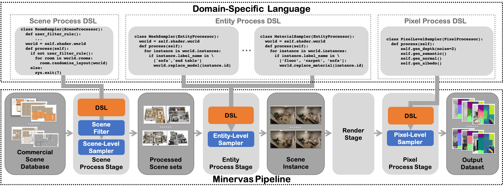

## Introduction to Minervas

<!-- Minervas is a scene cognitive training dataset solution for the interior scene agent industry. Users can use Minervas to generate large-scale low-cost scene recognition data sets based on Coohom's massive scene sets.

The core workflow of Minervas includes the following parts: -->

<!-- * `Scene Processor`: In this stage, user can filter and re-arrange the layout of 3D scene
* `Entity Processor`: User can modify scene content such as Light, Mesh, Material, as well as the camera. We also support to export the customized scene related structure information as JSON output -->
<!-- * `Render Processor`: Based on the processed 3D scene, use render engine to generate RGB and auxiliary channel images such as Depth, Normal, Semantic etc -->
<!-- * `Pixel Processor`: In this stage, user can add image processing algorithm to the previous stage output -->

<!-- Currently, we have deployed Minervas as an online system for public usage. Please check the [User Manual](./user_manual.md) for details. -->

Minervas is a *Massive INterior EnviRonments VirtuAl Synthesis* system. It aims to facilitate various vision problems by providing a programmable imagery data synthesis platform.

Based on the large-scale (more than 50 million) high-quality (professional artist designed) database of [Kujiale.com](https://www.kujiale.com), Minervas provides a way for all users to access and manipulate them for facilitating their data-driven task.

The pipeline of Minervas includes the following parts:
* `Scene Process Stage`: In this stage, users can filter scenes by their condition and re-arrange the layout of 3D scenes for domain randomization.
* `Entity Process Stage`: This Stage is designed for batch processing entities in the scene. Users can easily use entity-level samplers to randomize attributes of each entity, including furniture (\eg, CAD model, material, transformation), light (\eg, intensity, color), and camera (\eg, camera model, transformation). Modifying the attribute of each object manually is also supported.
* `Render Stage`: the system uses the generated scenes to generate 2D renderings with the photo-realistic rendering engine. 
* `Pixel Process Stage`: In this stage, users can apply pixel-wise processing operations on the imagery data.

Considering the flexibility and ease of use of the system, Minervas provides two ways of usage: a user-friendly GUI mode and a flexible programmable mode. In the programmable mode, the pipeline is fully controlled by the Domain-Specific Language (DSL). The DSL of Minervas is based on Python programming languages and contains multiple useful built-in functions as we will introduce in the next chapter. Moreover, as the diversity of the data is crucial for learning-based methods, Minervas also supports domain randomization both in GUI mode and programmable mode.

To get started with the web interface of Minervas, please read the [*Getting Started* page](user_manual.md). In this documentation, we provide a [DSL programming guide](dsl.md) of Minervas along with some [examples](examples.md) of vision tasks.

For more information, please visit our [project page](https://coohom.github.io/MINERVAS/). For any problem in usage or any suggestion, please feel free to contact us <minervas@qunhemail.com>.