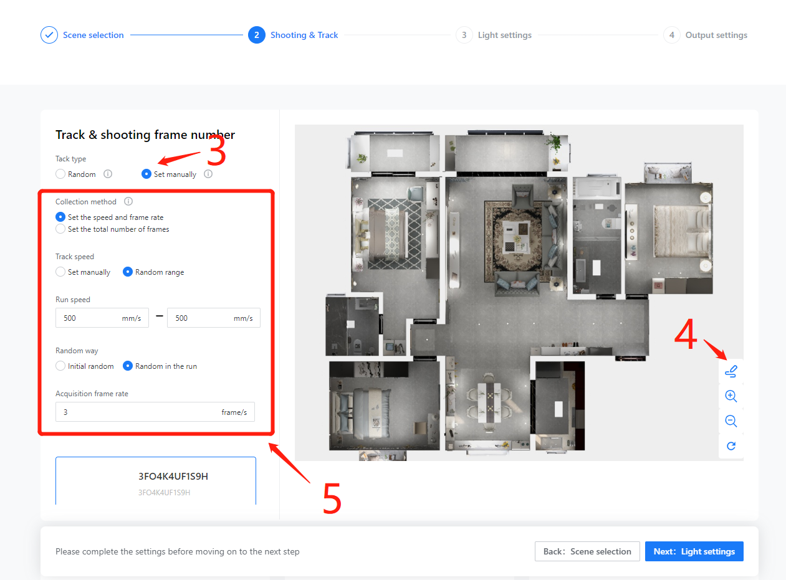
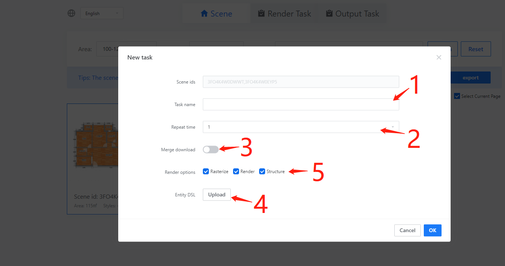
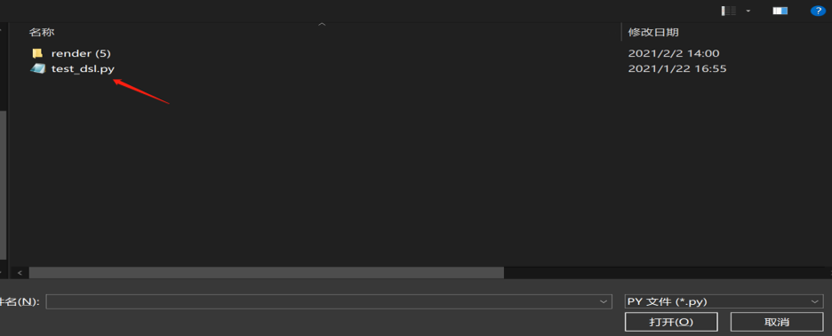
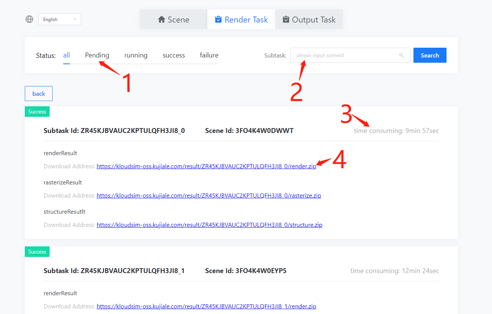
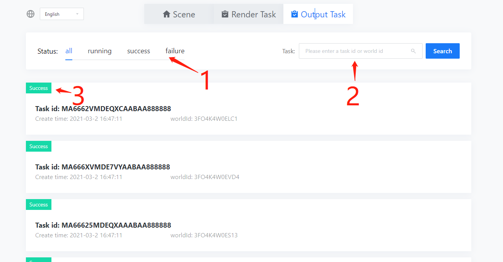
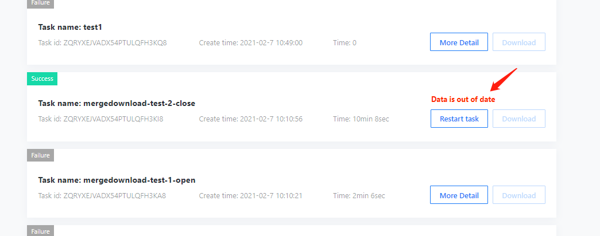

# Introduction

EUS (Environment Understanding Solution) is a scene cognitive training data set solution for the indoor agent industry. Users use EUS to generate large-scale low-cost scene recognition data sets based on KJL's massive scene sets.

# Basic configuration

This chapter mainly introduces basic configurations such as how to log in to an account, select scenes, and create simulation tasks.

## System login entrance
- Login URL：[https://www.kujiale.com/coohomcloud/minervas#/scene](https://www.kujiale.com/coohomcloud/minervas#/scene)

- Login account： Same as the Kujiale account, if it is a trial account, it will be allocated by the business separately

- login password： Same as the Kujiale account password, if it is a trial account, it will be notified by the business separately

Tips： It is recommended to use Google Chrome to log in

	☞Google Chrome download address https://www.google.com/chrome/
## Account login

 Click the account login on the system page, enter the account and password, and click login to log in to the home page of the EUS system.

## Change Passworod

To change the password, you need to enter the Kujiale homepage（https://www.kujiale.com/）, And then click the person’s avatar in the upper right corner of the system page, click Account Settings in the personal information pop-up window, click Account Security in the account settings page, and then click [Modify Password] in the Security Information Module. In the Modify Password pop-up window, enter the original password And the new password, the new password format requirements: ①The length is 8-16 characters; ②Cannot use spaces; ③Contain at least two combinations of numbers/letters/characters; ④Cannot contain illegal characters.。

## Create simulation task

After successful login, you will enter the EUS homepage-Scene Management.

1. You can create simulation task with click here.

## Task-set 0 choose mode

The first step of set the simulation task

1. You can input task name here.
2. The default setting is No, at this time, click Next to enter the visual configuration interface
3. Choose Yes to enter the dsl file configuration mode, you can complete the task configuration through the dsl file
4. click Next to enter the next step

## Task-set 1  Scene filter 

1. you can use the filter to search scene

2. click here to choose scene

3. click on the cover image to view the scene details

4. click here to go to the next step

   

## Task-set 2  Shooting & Track  

1. you can choose track type，such as random track here

2. you can set the  random track parameter here

3. you can click here if you need manually generate trajectories

4. click here to enter track editing mode

5. you can set the  track parameter here

   

## Create simulation task with DSL file

you can also create a simulation task with DSL file and enter the simulation task setting pop-up window.

1. The name of the task is required, which can record the main purpose of the task and facilitate the subsequent search for the task

2. The default number of repetitions is 1, and it is recommended to use it with random ability

3. After the merge download is turned on, the task results will be merged and processed, and all task results can be downloaded with one click (it is not recommended to open for a large number of scene tasks, too large task results will cause synthesis failure or download abnormality)

4. The task's processing of the scene is based on the DSL file, and the DSL file is currently in python format

5. The rendering results support selective output, rasterization refers to auxiliary images (depth maps, semantic maps, etc.), rendering as RGB images, and structure refers to extracting scene or camera information to an output json file

6. After completing the configuration, click OK to create a task, and automatically jump to task management.

## DSL description

The essence of DSL writing is that the user customizes one or more subclasses in the python file. The subclasses: three subclasses inherited from the Processor class inside Ks-SDK, borrowing the interface provided by the SDK and inherited attributes, in the process() function Realize custom functions in, such as:

- Scene modification: users modify the content of the scene (furniture, lighting, etc.), modify camera information (including ordinary cameras and track cameras)

- Rasterize data generation: based on the scene and camera, use the FF engine to generate instance, normal, and depth maps

- Render data generation: based on the scene and camera, use the photo-realistic renderer to generate rgb images

- Information extraction (Structure): extract scene or camera information to an output json file

About DSL-Detailed description, please refer to [DSL Description Document](https://coohom.github.io/cloud-docs/)

# Task management

## Simulation Task

This module displays the status of simulation tasks, and provides task query, screening, and result download.

### Task List

1. Support filtering tasks in different states

2. You can search for the corresponding task by task id or task name

3. When the remaining available renderers are displayed

4. For task details, click to view the status of subtasks

5. Tasks whose task status is successful, support click to download task results

6. After the task is successful, the result data will be stored in the cloud for 14 days and needs to be downloaded in time

### Subtask list

The subtask list can display the details of each subtask. Currently, one scene corresponds to one subtask;

1. Subtasks also support filtering subtasks by status

2. Subtasks support filtering subtasks by subtask id or scene id

3. The upper right corner of the subtask will display the specific time consumed by the subtask

4. Successful subtasks will show download links

Glossary:

Rendering task: Based on the scene and camera, use the photo-realistic renderer to generate RGB images

Auxiliary image tasks: based on the scene and camera, generate depth maps, semantic maps, instance maps, normal maps, etc.

Structural task: extract scene or camera information to an output json file

## Output task

This task is only open to users who have activated RW products. Users who have not purchased RW can ignore this part of the product introduction.

### Output task list

1. Support to filter tasks by status

2. Support filtering tasks by task id or scene id

3. The task status will be displayed in the upper left corner of the task. On average, each export task takes 15~20min. If the status is displayed as successful, you can view it normally in RW and use the corresponding scene for robot simulation training tasks.   

# Common problem

Q: Is the scene list empty?

A: If you have purchased the scene, please contact the customer to confirm whether it is faulty. If you have not purchased the scene, please contact the sales to purchase it.

 

Q: When the page is refreshed, it prompts that the permissions are insufficient?

A: The login is invalid and you need to log in again.

Q: When logging in to the system, I did not enter the login page, but directly entered a form filling page?

A: This is a reminder page for customers who are not logged in or who have not purchased EUS and directly access other pages of the system (such as the task list) through the URL to help potential customers send emails to establish contact with sales. For customers who have purchased, please visit the system homepage, or log in to the Kujiale website first, and then visit the system homepage.

Q: How to buy more scenes?

A: Currently, online purchase is not supported, please contact the sales directly to purchase more scenarios

Q: What should I do if the task data expires?

A: Tasks with expired data support one-click restart tasks and generate data again. Please download the data in time. 

Q: How long does it take to run a task?

A: It is mainly related to two factors. One is whether it is during the day or at night. During the day, the cluster has an upper limit of concurrent tasks, and it is easy to encounter queues. There are fewer queues at night. The second is the settings of the task itself, such as the number of scenes included, and the scenes. The size, specific task parameters, etc. are related. Trajectory tasks usually take a long time. A scene needs to wait 3 to 6 hours on average. If there are multiple scenes, the waiting time is even more uncertain. Cross-day tasks will be limited due to peak hours during the day Frequent queuing during the day, which consumes much more time than a task that can be run at night. Since the task data retention period is 2 weeks, it is not recommended that a single task exceeds 200 scenarios.

Q: How is the machine time calculated? Why is it sometimes far greater than the task waiting time, and sometimes it is less than the task waiting time?

A: The rendering machine mainly includes two parts. One part is the generation of RGB images. The rendering cluster is a multi-threaded cluster. The rendering task itself can be disassembled into multiple threads for parallel processing. The cluster server is a 72-core server, which will accumulate all tasks. The processing time is the rendering machine time, so sometimes there will be a situation of waiting for 5 minutes from the task creation to the end of the task, the rendering machine time is 2 hours, and the other part of the machine time is the auxiliary image (depth map, semantic map, normal map, etc.) Processing time, this part cannot be processed in parallel by the cluster, and it will encounter queuing, which sometimes leads to a situation of waiting 4 hours from task creation to completion, and 2 hours of machine time calculation. The final machine time consumption is the sum of the two, rendering machine time + auxiliary image processing machine time, that is, the task queue waiting time is not counted.

